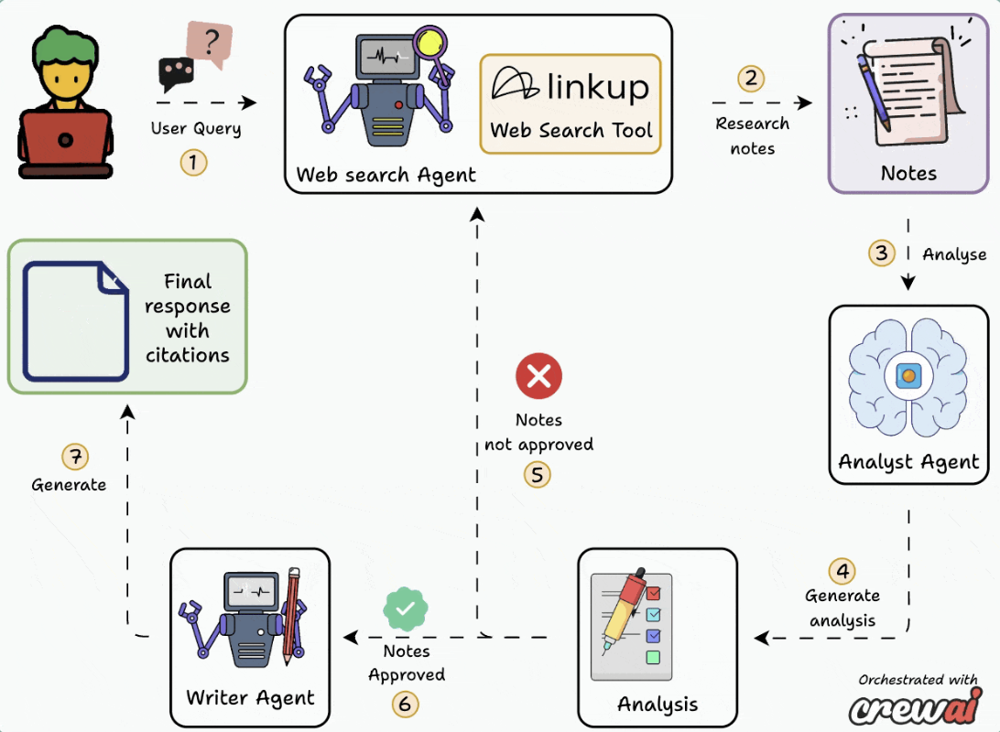

# 🚀 MDR - 你的智能研究助手

欢迎来到 **MDR（MCP-Powered Deep Researcher）**！  
## 💡 它能做什么？

- 🔍 执行标准或深度网络搜索
- 🧠 自动分析并提炼关键信息
- 📄 生成带有引用链接的专业级研究报告
- ⚙️ 支持通过 MCP 协议调用，轻松集成到其他系统中
- 🖥️ 可选 Streamlit 界面，方便快速使用

## 🔄 工作流程概览



## Demo Video 🎥


## 🛠 技术栈

- **Python >=3.11**
- [CrewAI](https://github.com/joaomdmoura/crewai)：构建多智能体协作框架的利器
- [LinkUp SDK](https://linkup.ai/)：让网络搜索变得简单高效
- [MCP](https://github.com/withcatai/mcp)：标准化工具通信协议
- [Streamlit](https://streamlit.io/)（可选）：用于构建用户界面

## 📦 安装依赖

确保你已经安装了 [Ollama](https://ollama.com/) 并运行本地模型（如 `qwen3:8b`）：

```bash
uv sync
```


## 🔐 配置 API Key

在开始之前，请先设置环境变量：

```bash
export LINKUP_API_KEY=your_linkup_api_key_here
```

> 如果没有 LinkUp API Key，可以在这里注册获取：[Get your API key](https://app.linkup.so/sign-up)


## ▶️ 如何运行

### MCP服务：

```json

 {
   "mcpServers": {
     "crew_research": {
       "command": "uv",
       "args": [
        "--directory",
        "abslute/path/to/project_root",
        "run",
        "server.py"
       ],
       "env": {
        "LINKUP_API_KEY":"your_linkup_api_key_here"
       }
     }
   }
 }

```

### 本地运行：

```bash
streamlit run app.py
```


## 🗂 项目结构一览

```
├── README.md        # 使用说明 😊
├── agents.py        # 多代理逻辑与任务定义
├── app.py           # Streamlit前端界面
├── pyproject.toml   # 项目配置与依赖
└── server.py        # MCP服务器入口
```

## 👥 贡献者欢迎！

如果你喜欢这个项目，欢迎提交 PR 或 Issue 来帮助我们改进。一起打造更聪明的研究助手吧！


## 🙌 感谢使用 MDR！

有任何疑问或建议？欢迎随时提出。祝你研究愉快，效率爆表！🚀
